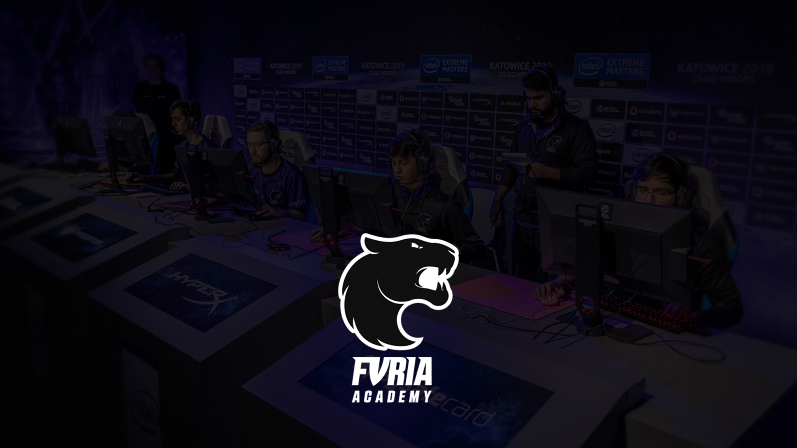
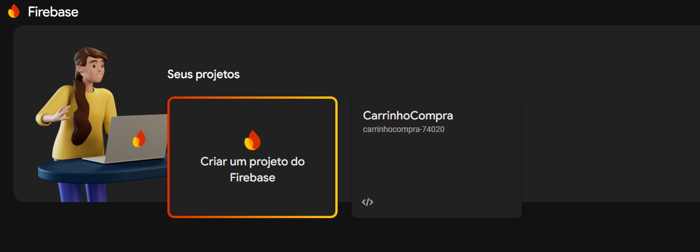
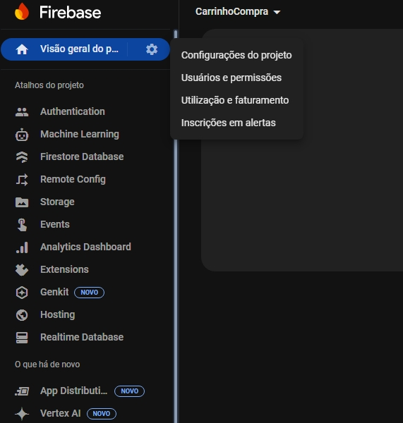
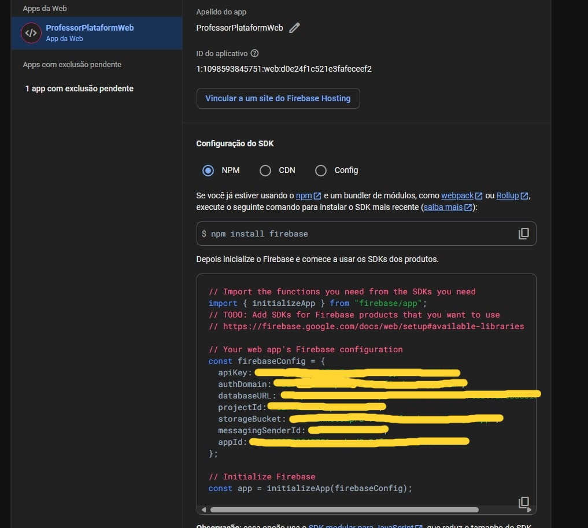
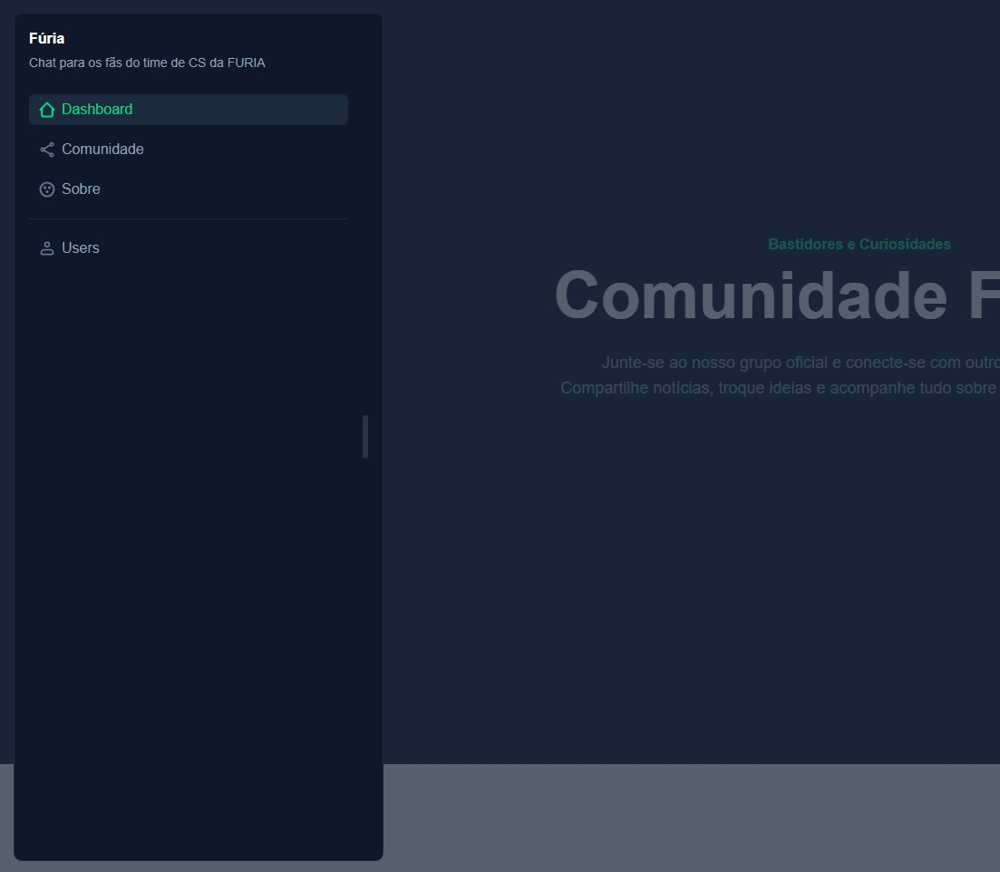
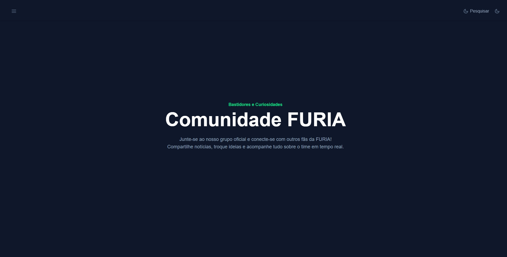
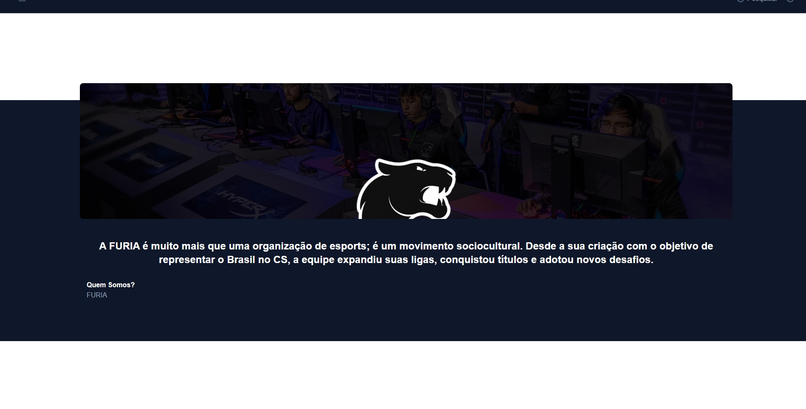

# Challenger #1: Experiência Conversacional

Desenvolver um caso de uso conversacional relacionado à FURIA (Telegram, web chat ou mobile chat)



## Stack utilizada

**Front-end:** Vue, NuxtUi, TailwindCSS

**Back-end:** Firebase

## Passo-a-Passo

### 1 - Clonar o Repositório

```bash
git clone https://github.com/MarshFfeco/FuriaExperienciaConversacional.git
cd nome-projeto
```

### 2 - Instalar Dependências

```bash
# Usando npm
npm install

# Ou usando yarn
yarn install
```

### 3 - Configurar Variáveis de Ambiente

#### 3.1 - Criar um projeto no firebase



#### 3.3 - Acesse as configurações do projeto



#### 3.4 - Pegue as informações na variável `firebaseConfig` e coloque no arquivo .env



### 4 - Executar o Projeto

```bash
npm run dev
```

## Screenshots





## Versão

4.0.0